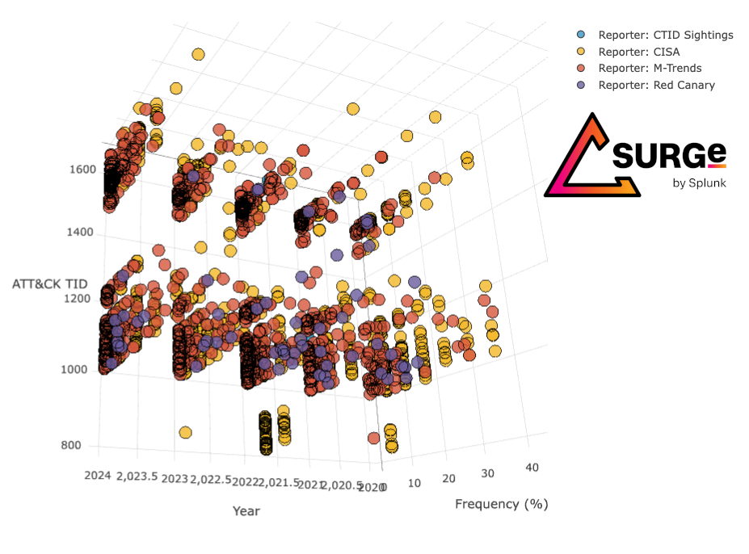

# macro-level-attack-trending
POC: rfetterman@splunk.com   
This repo contains Aggregated ATT&amp;CK technique reporting data. This work was presented at Splunk GovSummit 2022, and RSA 2023 (<a href="https://www.rsaconference.com/Library/presentation/USA/2023/Threat%20Informed%20Planning%20with%20Macrolevel%20ATTCK%20Trending">"Threat-Informed Planning"</a>). 

<b>Last Updated:</b> Sept 9, 2024

<h3>Link to Blogs:</h3> 
- 2022: https://www.splunk.com/en_us/blog/security/zoom-enhance-finding-value-in-macro-level-att-ck-reporting.html 
- 2023: https://www.splunk.com/en_us/blog/security/revisiting-the-big-picture-macro-level-att-ck-updates-for-2023.html 
- 2024: TBD   

Private Sector Yearly Threat Intelligence Reporting Sources:
- Mandiant M-Trends (2020-2024), 
- Red Canary Threat Reports (2020-2024), 
- Center for Threat Informed Defense (CTID) – ATT&CK Sightings Project (2022, 2024)

Public Sector Threat Intelligence Reporting Sources:
- CISA National Cyber Awareness System – Alerts (2020-2023)

### License

Copyright 2023 Splunk Inc.

Licensed under the Apache License, Version 2.0 (the "License"); 
you may not use this file except in compliance with the License. 
You may obtain a copy of the License at

http://www.apache.org/licenses/LICENSE-2.0

Unless required by applicable law or agreed to in writing, 
software distributed under the License is distributed on an "AS IS" BASIS, 
WITHOUT WARRANTIES OR CONDITIONS OF ANY KIND, either express or implied.
See the License for the specific language governing permissions and limitations under the License.
